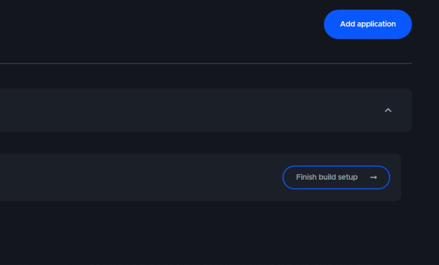
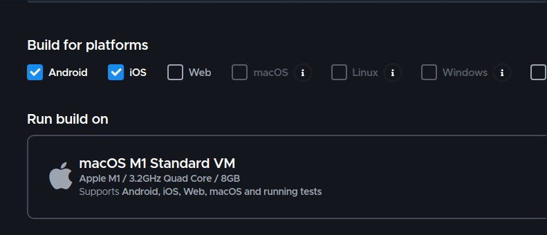
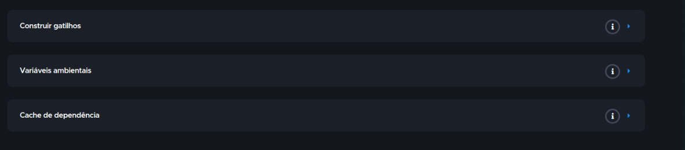
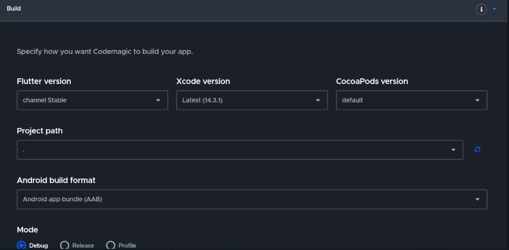
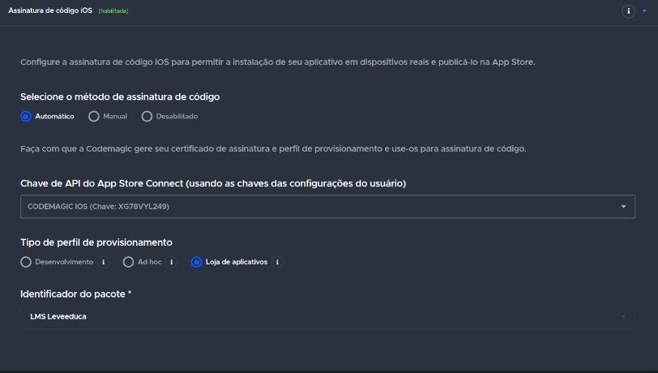
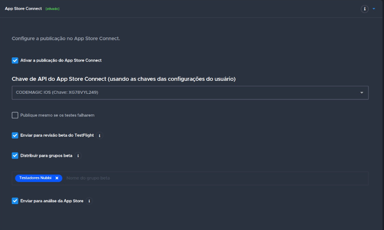

# Conseguir o acesso da Apple e da Google

## Acessar o site codemagic.io

Criar uma conta no codemagic  
Logar com a conta do seu repositório(BitBucket)  
Você irá selecionar seu repositório  
Criar o Build SetUp  
  
Selecionar as plataformas que deseja Buildar  
  
Caso queira, colocar variáveis de ambiente e gatilhos de esteira, mas não iremos fazer isso  
  
No Build iremos colocar a versão da Build e do XCode e o modo de Build(release, Debug,...)  
  
Na distribuição iremos colocar as chaves de acesso de cada plataforma, IOS e Android  
Vamos começar com a Plataforma IOS, nela precisamos adicionar sua chave de API do App Store Connect para habilitar a  
assinatura automática de código para aplicativos iOS.  
  
Isso pode ser feito clicando em, Assinatura em código IOS(Automático)  
Você vai ter que deixar seu aplicativo com as mesmas configurações  
  
(colocar print depois, borar itens dentro)  
